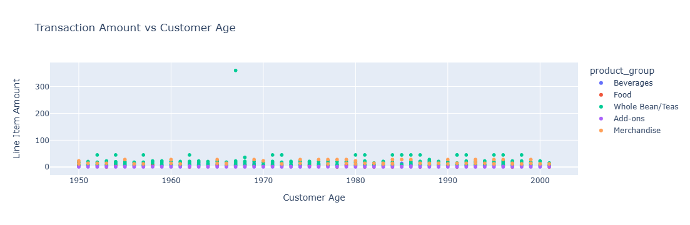
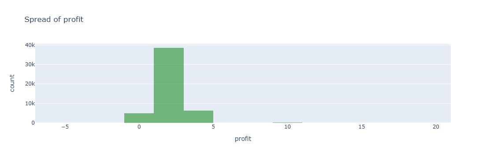

# Coffee Shop Sales Analysis

**Date: May 2024**

| Platform      | Link                                                                                                                                    |
|---------------|-----------------------------------------------------------------------------------------------------------------------------------------|
| GitHub        | [Coffee Shop Sales Analysis](https://github.com/PinarGib/Coffee-Shop-Sales)                                                             |

Analysed sales data from 50,000 transactions to identify high-margin products, top-spending customer groups, and top-selling products. Investigated sales performance by day and time. Utilised Pandas for data cleaning and exploration, and Plotly for visualisations and data summaries.

**Skills:**  Data Wrangling · Data Analysis · Python · Pandas · Plotly · Jupyter Notebook · Data Visualization
