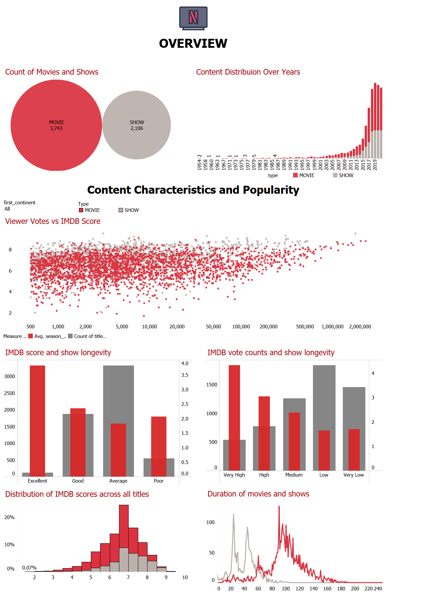
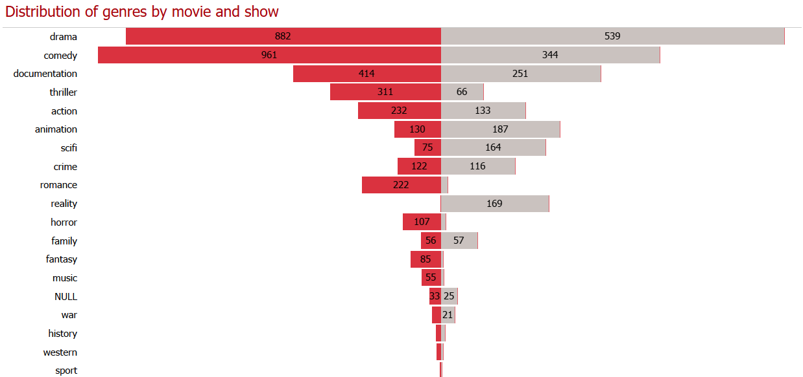

# Netflix Content Analysis

**Jun 2024**

| Platform | Link                                                                                                           |
|----------|----------------------------------------------------------------------------------------------------------------|
| Tableau  | [Netflix Analysis on Tableau](https://public.tableau.com/app/profile/pinar.gibson/viz/Netflix_analysis_17188796913460/Netflixthroughtheyears) |
| GitHub   | [Netflix Analysis on GitHub](https://github.com/PinarGib/Netflix-Analysis)                                     |

Conducted an in-depth analysis of Netflix's content library and user ratings to identify patterns and trends in viewer preferences and what makes a title successful. Key objectives included determining the most popular genres and target age groups across continents, analyzing the performance of original content versus licensed content, and identifying the characteristics of highly-rated titles. The analysis also investigated the distribution of content by release year and the impact of star ratings and vote counts on viewership.

Utilized Python pandas library for data cleaning, preprocessing, and transforming the data, ensuring the data was structured and free of inconsistencies. Employed exploratory data analysis techniques to uncover insights and trends within the dataset. Created visualizations using Plotly, Seaborn, and interactive dashboards using Tableau, enabling dynamic data exploration and presentation of findings. Scraped Wikipedia using Python to identify Netflix Originals, allowing for a boolean classification of titles in the dataset.

**Key insights derived from the analysis include:**

- Identification of top-performing genres and target age groups with their growth trends over time across continents.
- Comparison of user ratings and viewership metrics between Netflix Originals and licensed content.
- Analysis of release year distributions of genres and their correlation with viewer ratings.
- Insights into the attributes of highly-rated content, such as genre, release year, and type (movie or TV show).
- The project provided actionable recommendations for content acquisition and production strategies to optimize viewer engagement and satisfaction.

**Skills:** Python · Seaborn · Tableau · Data Analytics · SQLite · Web Scraping
